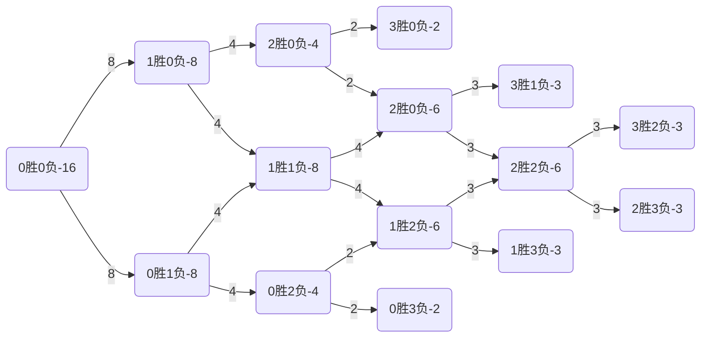

竞技比赛之所以如此吸引人，除了选手的精彩表现，还有赛制引发的一系列“故事”。今天带领大家欣赏一波赛制规则，不要绕晕了哦。

*为了方便兼顾接下来所有的赛制，我们假设参赛的队伍都是16支。*

### 1.小组赛制

> 小组赛是将参赛队伍做初步筛选的一个比赛阶段，如NBA的常规赛，S系列赛的小组赛，世界杯的小组赛。

#### 1.1.循环赛

> 将16支队伍分为4个小组，每组4支队伍，假设为A/B/C/D，队伍A和B/C/D分别进行比赛，根据胜负关系，淘汰最后一支或两支队伍，其他队伍进行下一阶段比赛。也常见分为2组的情框，这里不做讨论。

- 分组一般根据之前的队伍排名可控随机分配
- 如果出现胜负关系/积分相同的情况，则进行加赛（垃圾赛制）  
- 总比赛至少24场

优点；
1. **操作简单**
2. **通用性强**

缺点：
1. **容易加赛**。如果单纯算积分，最后积分很容易存在相同的，然后看胜负关系，就更加蠢到极点
2. **存在无意义的比赛**。弱队输了两场比赛后，第三场基本就没有进行的意义了，为了荣誉？再像NBA常规赛收尾，弱队争着垫底，能好看？
3. **缺少悬念**。分组本身是根据排名来的，即一个组里有甲区的1号种子，乙2号，丙的3号，丁的4号，随着各种比赛职业化越来越强，一般都是1/2号种子晋级，所以循环赛更多是强队的热身赛
4. **不公平**。稳第一的队伍甚至可以决定第二名是谁，你气不气？
5. **人工分组，难以信服**。分组的依据值得商榷。

举些栗子：
- NBA

- 男篮世界杯

#### 1.2.瑞士轮
> 每支队伍每轮都是随机的和同组的一支队伍进行决出胜负的比赛，胜3场或负3场则不用再赛。小组由胜负场次决定，比如第一轮只有0胜小组，第二轮有1胜组和0胜组，第二轮有2胜组、1胜组（1负）、0胜组（2负）。

- 一个队伍最多赛5轮，至少赛3轮，总比赛固定33场
- 一般3败的队伍进入败者组或者直接淘汰
- 常见于国外比赛如CS:GO、国际象棋

优点：
1. **每场比赛都有赢的意义**。强队还是可以在第一轮或第二轮吃吃菠菜，也算优点吧（笑）
2. **随机性高**。因为是完全随机的分组，所以更有意思
3. **观赏性高**。第二轮后比赛都是实力相当的队伍，观赏性赛高！

缺点：
1. **条件苛刻**。对参赛队伍个数要求较高
2. **不是绝对公平**。第5轮比赛可能存在较强的两个队进行比赛的情况，运气也是实力的一部分吧，不过这一轮也是最好看的！

原文：https://ailoveu.github.io

举些栗子：
- DOTA2

*ps:有一年基辅Major采取的瑞士轮，然后Secert在单败的淘汰赛被爆冷，然后有人说是瑞士轮的锅，真是蠢到家了，赛制主办方也是运气真好。之后好像再也没有在dota里见到这伟大的赛制，只能说秘密演我瑞士轮啊（哭）*

### 2.淘汰赛

> 经过小组赛初步筛选，其中8支队伍晋级淘汰赛。

#### 2.1.单败赛
> 小组赛较强队伍对阵较弱队伍，分为4组，每组胜者进行下一轮，直至最后产生一名胜者。

- 第一轮为8强赛，第二轮为半决塞，第三轮为决赛
- 至少比赛8场

优点：
1. **操作傻瓜**。

缺点：

1. **对较强队不友好**。极端情况，冠亚军队伍在首轮就遇到，根据排名分配奖金的情况下很难服众。
2. **一眼看到底的对阵**。比赛外的分组也是看点的一部分！
3. **容错率低**。以TI7的Liquid为例，在第一轮就被硬实力较弱的IG战队打败，如果故事仅仅到这，也是是喷子们口诛笔伐的消遣而已，但因为Dota2有败者组机制，然后Liquid败者组一穿七夺得冠军，TI9更是复刻传奇，在首轮战败的情况下夺得亚军。
4. **侮辱**。部分奸商为了卖门票会安排三四名比赛，先不说第三名和第二名谁更强，这比赛本身对三四名队员来说就是一种侮辱，除非你不是来夺冠的（笑）。

举些栗子：
- 足球世界杯

#### 2.2 双败赛
> 分为败者组和胜者组，胜者组失败的队伍进入败者组。败者组失败直接淘汰。

- 胜者组冠军失败直接淘汰（笑）
- 最多比赛22场

优点：

1. **容错率高**。今天状态不好，明天打回来。
2. **公平公正**。排名更贴近真实水平。

缺点：

1. **比赛场次太多**。
2. **胜者组冠军没有再来一次的机会**。通过图表可以看出来，胜者组亚军有再来一次的机会，而胜者组冠军败了，就只能是亚军了。建议胜者组冠军最后bo5有先胜一局的优势。
3. **赛程不合理**。强如LGD，TI8最后一天要连续比赛8场比赛，北京线下观赛从凌晨看到第二天11点，观众都表示受不了。

举个栗子：
- Dota2
